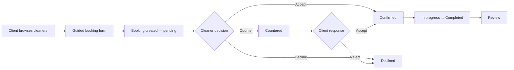

# CleanMatch

**A two-sided marketplace for booking home cleaning — built like a real product, not a tutorial.**

CleanMatch connects homeowners with local cleaners. Clients browse profiles, describe their home through a guided intake flow, and send a booking request with transparent pricing. Cleaners review incoming jobs, accept or decline, and negotiate scope when needed. The platform handles auth, permissions, pricing snapshots, photo references, reviews, and transactional email — all on a modern full-stack TypeScript stack.

---

## Why this project exists

Marketplaces are deceptively simple on the surface. Under the hood they need role-based access, row-level security, pricing logic that survives negotiation, and UX that works on a phone at the kitchen counter.

CleanMatch is my answer to that problem: a production-shaped cleaning marketplace where business rules live in the database and application layer, not in comments. Every booking stores a **scope snapshot** so both sides agree on what was quoted, even after counter-offers.

---

## Highlights at a glance

| Area | What it does |
|------|----------------|
| **Guided booking intake** | 3-step form: scope → time & price → review & schedule |
| **Deterministic pricing engine** | Estimates hours from home details; shows 15% platform fee upfront |
| **Counter-offers** | Cleaners adjust scope/hours; clients accept or reject with repriced totals |
| **Booking photos** | Clients attach up to 2 reference photos; cleaners view via signed URLs |
| **Reviews & trust** | Post-job ratings aggregated on cleaner browse cards |
| **Email notifications** | Resend-powered alerts for new requests, accepts, and declines |
| **Security-first data layer** | Supabase RLS on every table; private storage bucket policies |

---

## How it works



**Client journey**

1. Sign up as a client and browse available cleaners (hourly rate, bio, reviews, service radius).
2. Book a cleaner through a step-by-step intake: visit type, areas to clean, conditions, add-ons, requested hours, address, and schedule.
3. Optionally attach reference photos so the cleaner understands the job before responding.
4. Track bookings, respond to counter-offers, cancel when allowed, mark complete, and leave a review.

**Cleaner journey**

1. Sign up as a cleaner and complete onboarding (rate, radius, experience, profile photo).
2. View the job board for open requests or manage assigned incoming requests.
3. Review scope, photos, and pricing snapshot — then accept, decline, or send a counter-offer.
4. Manage confirmed jobs from the dashboard.

---

## Feature deep-dive

### Intake & pricing

The booking form collects structured scope data (bedrooms, bathrooms, kitchen, living areas, pet hair, last cleaned, extra tasks, and more). A **deterministic estimator** — no external AI — calculates:

- Recommended hours
- Min / max allowed hours
- Line-item time breakdown
- Total price = `(hourly rate × hours) + 15% platform fee`

Clients can request fewer hours than recommended (with a clear warning), but not below the platform minimum.

### Counter-offers

When scope or time needs adjustment, cleaners submit a counter with editable fields and a reason. The system recalculates pricing, stores adjustments in JSON, and moves the booking to `countered` status. Clients accept or reject from their bookings page — totals update from stored snapshots, not live rate lookups.

### Booking photos

Clients can upload up to 2 photos (JPEG, PNG, WebP; 5 MB each) when submitting a request. Files live in a **private** Supabase Storage bucket (`booking-photos`). Row-level and storage policies ensure only the booking client and assigned cleaner can access them. Cleaners see thumbnails on the request page and can click to view larger.

### Reviews

After completion, clients leave a 1–5 star rating and optional comment. Review stats (average rating, count) surface on cleaner browse cards to help clients choose with confidence.

### Email

Transactional emails via [Resend](https://resend.com) notify cleaners of new requests and clients when a cleaner accepts or declines.

---

## Tech stack

| Layer | Choice |
|-------|--------|
| Framework | [Next.js 14](https://nextjs.org) App Router, TypeScript (strict) |
| UI | [Tailwind CSS](https://tailwindcss.com) + [shadcn/ui](https://ui.shadcn.com) |
| Auth & database | [Supabase](https://supabase.com) — Auth (SSR), PostgreSQL, Storage |
| Payments | [Stripe](https://stripe.com) — API routes for payment intents & webhooks |
| Email | [Resend](https://resend.com) |
| Deployment | [Vercel](https://vercel.com) (target) |

---

## Architecture notes

**Server-first by default.** Server Components load data with the Supabase SSR client. Server Actions handle form mutations (booking creation, accept/decline, counter-offers, reviews). The browser Supabase client is used only where needed — e.g. direct photo uploads after a booking ID exists.

**RLS everywhere.** Clients, cleaners, and booking participants are enforced at the Postgres layer via Row Level Security policies, not just UI checks. A `is_booking_participant()` helper avoids recursive policy bugs on counter-offer updates.

**Immutable scope snapshots.** Each booking stores `scope_snapshot` (intake input, UI details, quote, and pricing at submission time). Counter-offers append structured adjustments without losing the original request.

**No secrets in the client.** Stripe secret keys and service-role credentials stay in API routes only.

```
app/
├── client/          # Client-facing pages (browse, book, bookings)
├── cleaner/         # Cleaner dashboard, requests, jobs, onboarding
├── api/             # Stripe webhooks, payment intents, intake API
├── login/ register/ # Auth flows
lib/
├── intake-estimate.ts   # Hours & scope estimation
├── booking-price.ts     # Platform fee & cent-safe pricing
├── counter-offer.ts     # Counter-offer parsing & repricing
├── booking-photos.ts    # Storage paths, validation, signed URLs
├── email/               # Resend notification helpers
supabase/
└── migrations/      # Versioned SQL schema + RLS policies
```

---

## Database

Core tables: `profiles`, `cleaner_profiles`, `bookings`, `booking_photos`, `reviews`, `disputes`, `notifications`.

Booking status flow:

`pending` → `confirmed` | `declined` | `countered` → `in_progress` → `completed` | `cancelled` | `disputed`

Migrations live in `supabase/migrations/` and are applied in timestamp order. TypeScript types in `lib/database.types.ts` mirror the schema.

---

## Getting started

### Prerequisites

- Node.js 18+
- A [Supabase](https://supabase.com) project
- (Optional) [Stripe](https://stripe.com) and [Resend](https://resend.com) accounts for payments and email

### 1. Clone and install

```bash
git clone <your-repo-url>
cd CleaningApp
npm install
```

### 2. Environment variables

Create `.env.local` in the project root:

```env
# Supabase (required)
NEXT_PUBLIC_SUPABASE_URL=https://your-project.supabase.co
NEXT_PUBLIC_SUPABASE_ANON_KEY=your-anon-key

# Email (optional — booking notifications)
RESEND_API_KEY=re_...
EMAIL_FROM="CleanMatch <onboarding@resend.dev>"
# DEV_OVERRIDE_TO=you@example.com   # route all emails to one inbox while testing

# Stripe (optional — payment API routes)
STRIPE_SECRET_KEY=sk_test_...
STRIPE_WEBHOOK_SECRET=whsec_...
```

### 3. Database & storage

Apply migrations to your Supabase project:

```bash
supabase db push
```

Create a **private** storage bucket named `booking-photos` in the Supabase dashboard (or confirm it already exists). Storage policies are included in the latest migration.

### 4. Run locally

```bash
npm run dev
```

Open [http://localhost:3000](http://localhost:3000). Register as a **client** or **cleaner** to explore each role's flow.

---

## Scripts

| Command | Description |
|---------|-------------|
| `npm run dev` | Start development server |
| `npm run build` | Production build |
| `npm run start` | Run production server |
| `npm run lint` | ESLint via Next.js |

---

## What I'd point out in an interview

- **Two-sided product thinking** — separate client and cleaner flows with shared booking state and participant-aware RLS.
- **Pricing integrity** — fee breakdown shown before submit; snapshots prevent silent repricing after negotiation.
- **Progressive upload pattern** — booking created first, photos uploaded second (avoids server-action body limits and duplicate bookings on retry).
- **Policy-aware storage** — private bucket + signed URLs + `storage.objects` policies tied to `booking_photos` rows.
- **Honest scope** — intake estimator is deterministic and testable; no fake "AI" wrapper.

---

## Roadmap

- [ ] Stripe Connect destination charges wired end-to-end in the booking checkout flow
- [ ] Cleaner match scoring (proximity, rating, recency, preference fit)
- [ ] Real-time notifications (Supabase Realtime)
- [ ] Admin dispute review tooling

---

## License

Private portfolio project. Contact me for access or a walkthrough.

---

<p align="center">
  Built with Next.js, Supabase, and attention to the boring parts that make marketplaces actually work.
</p>
